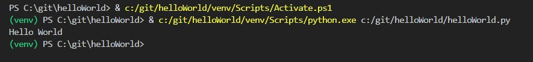

# Hello World project
This program outputs "Hello World" to the console
---
To set up my enviroment i took the following steps
- Install Visual Studio Code
- Install Python
- Install Git
- I then proceeded to create a GitHub account and a repository for this project.
After making the respository and writing this simple program, I pushed the code to
this repository using git inside Visual Studio Code.
Here is an image of the Hello World Program being run.

